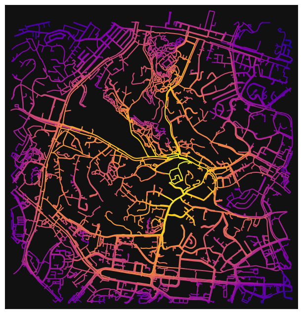
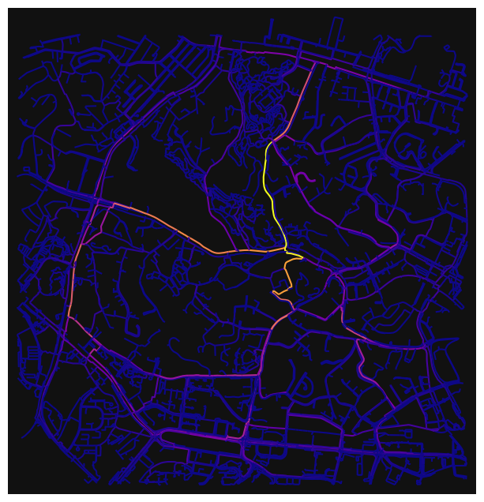
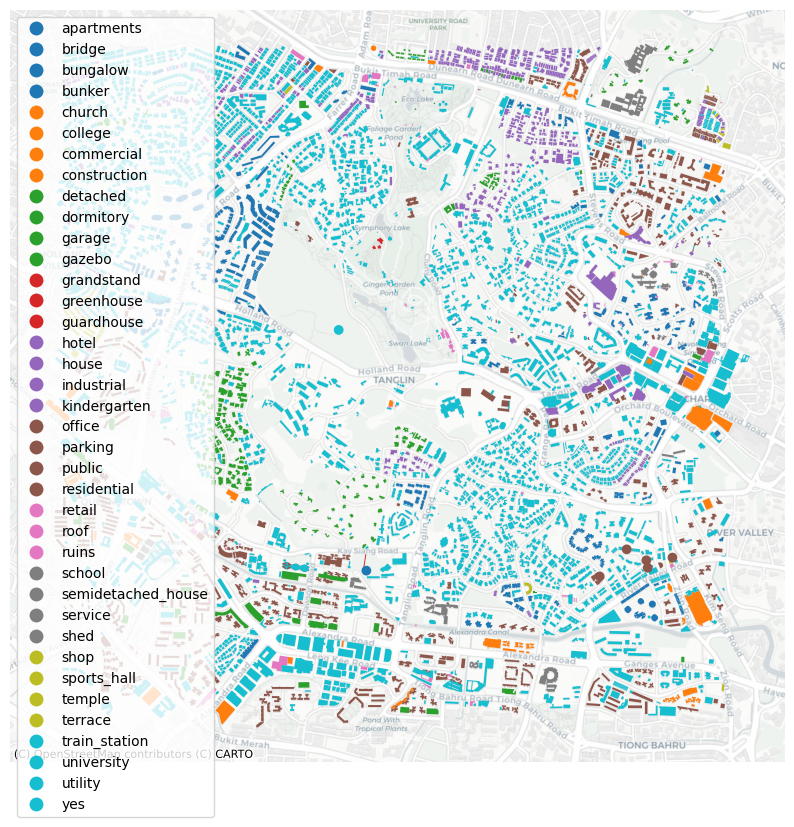
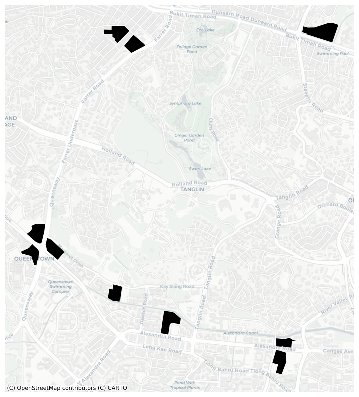

**Spatial Network Analysis of Tanglin, Singapore**

Singapore is a country of area 735.6km\({}^{2}\), 48% of the size of London. It is also dense, containing 5.9 million people, 67% of London's population.
The city-state is a global hub for finance, trade, and tourism, with highly developed infrastructure.

As will be discussed later, Tanglin is heavily residential, so has a high requirement for schools. I will address the question of new school placement in the Tanglin vicinity, attempting to optimise it for centrality and compare it to the placement of other schools in the area.


```python
#The following code is used to import necessary packages.

import numpy as np
import pandas as pd
import matplotlib
import matplotlib.pyplot as plt
import osmnx as ox
import networkx as nx
import matplotlib.cm as cm
import matplotlib.colors as colors

import sys
print (f'current environment: {sys.prefix}')

if ox.__version__=='2.0.1':

    print (f'current osmnx version: {ox.__version__}') 
else:
    print (f'current osmnx version: {ox.__version__}. Upgrade to osmnx=2.0.1 for the notebook to work')
```
    

The following lines of code import a graph spreading 2000m from Tanglin, Singapore.


```python
G=ox.graph_from_address('Tanglin, Singapore', dist=2000, network_type='walk')
```


```python
G.nodes(data=True)
```


```python
G.edges()
```


```python
nx.to_pandas_edgelist(G).head()
```


<div>
<style scoped>
    .dataframe tbody tr th:only-of-type {
        vertical-align: middle;
    }

    .dataframe tbody tr th {
        vertical-align: top;
    }

    .dataframe thead th {
        text-align: right;
    }
</style>
<table border="1" class="dataframe">
  <thead>
    <tr style="text-align: right;">
      <th></th>
      <th>source</th>
      <th>target</th>
      <th>access</th>
      <th>highway</th>
      <th>length</th>
      <th>bridge</th>
      <th>reversed</th>
      <th>service</th>
      <th>osmid</th>
      <th>junction</th>
      <th>tunnel</th>
      <th>maxspeed</th>
      <th>geometry</th>
      <th>width</th>
      <th>name</th>
      <th>oneway</th>
      <th>lanes</th>
    </tr>
  </thead>
  <tbody>
    <tr>
      <th>0</th>
      <td>26778964</td>
      <td>7687078877</td>
      <td>NaN</td>
      <td>primary</td>
      <td>7.149996</td>
      <td>NaN</td>
      <td>False</td>
      <td>NaN</td>
      <td>633243688</td>
      <td>NaN</td>
      <td>NaN</td>
      <td>50</td>
      <td>NaN</td>
      <td>NaN</td>
      <td>Orchard Road</td>
      <td>False</td>
      <td>5</td>
    </tr>
    <tr>
      <th>1</th>
      <td>26778964</td>
      <td>6135297390</td>
      <td>NaN</td>
      <td>primary</td>
      <td>38.147224</td>
      <td>NaN</td>
      <td>True</td>
      <td>NaN</td>
      <td>654742708</td>
      <td>NaN</td>
      <td>NaN</td>
      <td>50</td>
      <td>NaN</td>
      <td>NaN</td>
      <td>Orchard Road</td>
      <td>False</td>
      <td>5</td>
    </tr>
    <tr>
      <th>2</th>
      <td>26778964</td>
      <td>1670227476</td>
      <td>NaN</td>
      <td>residential</td>
      <td>16.568424</td>
      <td>NaN</td>
      <td>True</td>
      <td>NaN</td>
      <td>745356251</td>
      <td>NaN</td>
      <td>NaN</td>
      <td>50</td>
      <td>NaN</td>
      <td>NaN</td>
      <td>Cuscaden Road</td>
      <td>False</td>
      <td>1</td>
    </tr>
    <tr>
      <th>3</th>
      <td>60662421</td>
      <td>60662422</td>
      <td>NaN</td>
      <td>primary</td>
      <td>21.944106</td>
      <td>NaN</td>
      <td>True</td>
      <td>NaN</td>
      <td>480936965</td>
      <td>NaN</td>
      <td>NaN</td>
      <td>50</td>
      <td>NaN</td>
      <td>NaN</td>
      <td>Scotts Road</td>
      <td>False</td>
      <td>5</td>
    </tr>
    <tr>
      <th>4</th>
      <td>60662421</td>
      <td>60662421</td>
      <td>NaN</td>
      <td>[primary, primary_link]</td>
      <td>209.694514</td>
      <td>NaN</td>
      <td>[False, True]</td>
      <td>NaN</td>
      <td>[21943945, 173713426, 481676025]</td>
      <td>NaN</td>
      <td>NaN</td>
      <td>50</td>
      <td>LINESTRING (103.8322287 1.3054926, 103.8321501...</td>
      <td>NaN</td>
      <td>[Scotts Road, Orchard Road]</td>
      <td>False</td>
      <td>[2, 4, 5]</td>
    </tr>
  </tbody>
</table>
</div>


```python
#The following code plots the graph.
ox.plot_graph(G)
```


```python
gdf_nodes, gdf_edges = ox.graph_to_gdfs(G)

Base_map = gdf_edges.explore(color='red')
Base_map
```


```python
#The following code outputs statistics from the graph.
stats = ox.basic_stats(G)
stats
```


    {'n': 6961,
     'm': 19216,
     'k_avg': 5.52104582674903,
     'edge_length_total': 857609.9870364504,
     'edge_length_avg': 44.62999516217997,
     'streets_per_node_avg': 2.7983048412584397,
     'streets_per_node_counts': {0: 0, 1: 1460, 2: 0, 3: 3993, 4: 1500, 5: 8},
     'streets_per_node_proportions': {0: 0.0,
      1: 0.20973997988794713,
      2: 0.0,
      3: 0.5736244792414883,
      4: 0.215486280706795,
      5: 0.0011492601637695732},
     'intersection_count': 5501,
     'street_length_total': 428804.9935182236,
     'street_segment_count': 9608,
     'street_length_avg': 44.6299951621798,
     'circuity_avg': 1.104060296930391,
     'self_loop_proportion': 0.0043713572023313906}


```python
DG = ox.convert.to_digraph(G)
```

The following segments of code calculate different forms of centrality for Tanglin and the surrounding region - degree, closeness and betweenness. This region sits outside the CBD, and is a residential and diplomatic enclave - the urban environment enhanced with green spaces such as the Singapore Botanic Gardens. Closeness and betweenness peak around Holland Road and Tanglin Road, thoroughfare streets central to the network.


```python
#Find Degree Centrality
edge_dc = nx.degree_centrality(nx.line_graph(DG))

nx.set_edge_attributes(DG, edge_dc,'dc')

G1 = nx.MultiGraph(DG)
```


```python
#Plot degree centrality
nc = ox.plot.get_edge_colors_by_attr(G1, 'dc', cmap='plasma')
fig, ax = ox.plot_graph(G1, node_size=0, node_color='w', node_edgecolor='gray', node_zorder=2,
                        edge_color=nc, edge_linewidth=1.5, edge_alpha=1)
```


```python
#Closeness Centrality
edge_cc = nx.closeness_centrality(nx.line_graph(DG))
#inscribe attribute
nx.set_edge_attributes(DG,edge_cc,'cc')
G1 = nx.MultiGraph(DG)
#plot
nc = ox.plot.get_edge_colors_by_attr(G1, 'cc', cmap='plasma')
fig, ax = ox.plot_graph(G1, node_size=0, node_color='w', node_edgecolor='gray', node_zorder=2,
                        edge_color=nc, edge_linewidth=1.5, edge_alpha=1)
```


    

    


```python
edge_bc = nx.betweenness_centrality(nx.line_graph(DG))
```


```python
#inscribe attribute
nx.set_edge_attributes(DG,edge_bc,'bc')
G1 = nx.MultiGraph(DG)
#plot
nc = ox.plot.get_edge_colors_by_attr(G1, 'bc', cmap='plasma')
fig, ax = ox.plot_graph(G1, node_size=0, node_color='w', node_edgecolor='gray', node_zorder=2,
                        edge_color=nc, edge_linewidth=1.5, edge_alpha=1)
```


    

    


```python
#Spatial network adjusted to fit osmnx map geometry
tags= tags={'amenity': True, 'highway':True, 'landuse':True, 'building':True, 'waterway': True, 'railway': True}
all_geom=ox.features_from_address('Tanglin, Singapore', tags, dist=2000)
all_geom = all_geom.to_crs(epsg=3857)
```


```python
#Plot the building locations from osm data
fig,ax = plt.subplots(figsize=(10,10))
all_geom[all_geom['building'].notna()].plot(ax=ax,color='black')
import contextily as ctx
ctx.add_basemap(ax,source=ctx.providers.CartoDB.Positron)
plt.axis('off')
plt.show()
```

I plotted buildings along with their use, to understand amenity locations. Sadly, osmnx does not offer such accurate data for this region, filling numerous building categories with 'Yes' - degrading the utility of this map for analysis.


```python
#plot osm buildings with their use
fig,ax = plt.subplots(figsize=(10,10))
all_geom[all_geom['building'].notna()].plot('building',
                                            ax=ax,
                                            categorical=True,
                                            legend=True,
                                            cmap='tab10')

import contextily as ctx
ctx.add_basemap(ax,source=ctx.providers.CartoDB.Positron)
plt.axis('off')
plt.show()
```


    

    


To counteract the poor labelling in the previous map, I decided to map only schools in the area - shown in black on the figure. While distributed along main roads (according to centrality analysis), they are separated from the thoroughfares, Holland Road and Tanglin Road. This implies a necessity for accessibility, but simultaneously a preference for partition from the busiest areas. Therefore, I would suggest that taking into account the higher number of schools in Queenstown and near Alexandra Road, a further school should be placed in the vicinity of Bukit Timah road - taking advantage of nearby green spaces, and accessibility.


```python
fig,ax = plt.subplots(figsize=(10,10))
all_geom[all_geom['school'].notna()].plot(ax=ax,color='black')
import contextily as ctx
ctx.add_basemap(ax,source=ctx.providers.CartoDB.Positron)
plt.axis('off')
plt.show()
```


    

    

